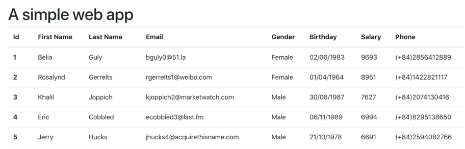

- Understand Directives, Pipes and Services in Angular
- Able to use built-in Directives, Pipes
- Able to create/use custom Directives, Pipes and Services
__
- A list of users inside users.json file
- An Angular web app that display a list of users like figure below

